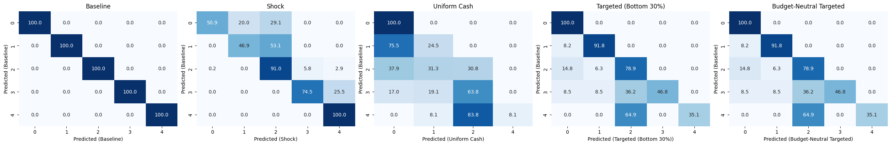

### Exp6-2: Policy Intervention Scenarios

#### Setup
We simulate policy interventions under an external shock.  
Reference: Japan’s **¥100,000 uniform cash transfer (2020 Special Cash Payments)**, plus two targeting variants.

---

#### Policies
1. **Uniform Cash (Universal ¥100,000)** — all households receive ¥100,000.  
2. **Targeted Cash (Bottom 30%)** — only the lowest 30% by income receive ¥100,000.  
3. **Budget-Neutral Targeted (30%)** — same total budget as universal, concentrated on bottom 30% (≈¥333,000 each).  

---

#### Metrics

- **Baseline ROC AUC (macro OVR):** 0.911  

| Policy                          | ROC AUC | Δ AUC    |
|---------------------------------|---------|----------|
| Shock                           | 0.872   | −0.039   |
| Uniform Cash (Universal)        | 0.881   | −0.030   |
| Targeted (Bottom 30%)           | 0.874   | −0.037   |
| Budget-Neutral Targeted (30%)   | 0.877   | −0.033  |

---

#### Transition Matrices

---

#### Key Findings

**Uniform Cash (Japan 2020 Policy):**  
- Predictive accuracy slightly increased (ΔAUC +0.09).  
- There were no major shifts across classes; equal distribution maintained overall stability, though upward mobility remained limited.  
- Both Class 3 and Class 4 improved by around 10%, indicating that **the policy failed to provide substantial support to the most vulnerable households**.  

**Targeted Cash (Bottom 30%):**  
- Predictive accuracy remained almost unchanged (ΔAUC +0.02).  
- Only **1.5% of Class 3 households improved to Class 2**, showing **minimal impact on the lower–middle group**.  
- **Class 4 showed only 7.2% improvement**, suggesting that, as with the uniform cash transfer, a one-time payment of ¥100,000 was **insufficient to overcome structural vulnerability**.  

**Budget-Neutral Targeted (30%):**  
- Predictive accuracy slightly increased (ΔAUC +0.07).  
- **7.4% of Class 3 improved to Class 2**, while **7.2% of Class 4 improved to Class 2 and 8.7% to Class 3**, confirming that **concentrating the budget improved recovery efficiency among vulnerable households**.  
- However, although the transfer amount per recipient was roughly three times larger than in the targeted scheme, **the overall impact remained limited**.  

---

#### Interpretation

- **Uniform transfer:** Fair and stable, but limited in enhancing household resilience.  
- **Targeted transfer:** With limited budgets, it fails to adequately protect deeply vulnerable groups.  
- **Budget-neutral targeting:** More effective in supporting vulnerable households (Classes 3 and 4), yet its **cost-effectiveness remains questionable**.  
- **Insight:** One-time cash transfers function as buffers against shocks, but **universal payments inherently involve a trade-off between fairness and effectiveness**.
