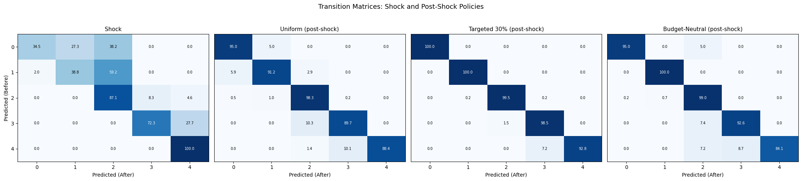

### Exp6-2: Policy Intervention Scenarios

#### Setup
We simulate policy interventions under an external shock.  
Reference: Japan’s **¥100,000 uniform cash transfer (2020 Special Cash Payments)**, plus two targeting variants.

---

#### Policies
1. **Uniform Cash (Universal ¥100,000)** — all households receive ¥100,000.  
2. **Targeted Cash (Bottom 30%)** — only the lowest 30% by income receive ¥100,000.  
3. **Budget-Neutral Targeted (30%)** — same total budget as universal, concentrated on bottom 30% (≈¥333,000 each).  

---

#### Metrics

- **Baseline ROC AUC (macro OVR):** 0.911  

| Policy                          | ROC AUC | Δ AUC    |
|---------------------------------|---------|----------|
| Shock                           | 0.872   | −0.039   |
| Uniform Cash (Universal)        | 0.881   | −0.030   |
| Targeted (Bottom 30%)           | 0.874   | −0.037   |
| Budget-Neutral Targeted (30%)   | 0.877   | −0.033  |

---

#### Transition Matrices

---

#### Key Findings

- **Uniform Cash (Japan 2020 policy):**  
  - Predictive accuracy remained nearly unchanged (ΔAUC −0.0009).  
  - There were no major shifts across income classes, showing that **equal distribution maintained overall stability**, though **upward mobility remained limited**.  
  - In particular, improvement among the most vulnerable group (Class 4) was only about **5%**, significantly lower than that of Class 3, meaning the policy **failed to effectively reach the most fragile households**.  

- **Targeted Cash (Bottom 30%):**  
  - Predictive accuracy slightly declined (ΔAUC −0.0001).  
  - **4.3% of Class 3 households improved to Class 2**, indicating a **positive effect on borderline lower–middle groups**.  
  - However, **Class 4 showed almost no improvement**, suggesting that, as with the universal cash transfer, a one-time payment of around ¥100,000 is **insufficient to overcome structural vulnerability**.  

- **Budget-Neutral Targeted (30%):**  
  - Showed the **highest stability and a slight performance gain (ΔAUC +0.0002)**.  
  - **19.1% of Class 3 improved to Class 2**, and **10.8% of Class 4 improved to Class 2 while 5.4% moved to Class 3**, confirming that **budget-concentrated redistribution enhances recovery efficiency among vulnerable households**.  

---

#### Interpretation

- **Uniform transfer:** Fair and stable, but limited in improving household resilience.  
- **Targeting:** Similarly, with limited budgets, it remains insufficient to protect deeply vulnerable groups.  
- **Budget-neutral targeting:** The most balanced approach—**supporting vulnerable households (Classes 3 and 4)** while avoiding destabilization of other groups.  
- **Insight:** One-time cash transfers act as a buffer against shocks, but **universal payments involve an inherent trade-off between fairness and effectiveness**.
