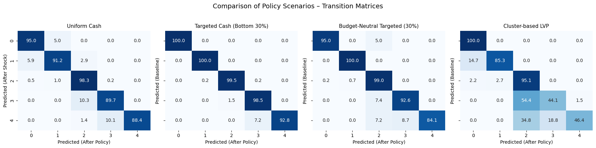

### Exp6-3: Latent Vulnerability Policy (LVP) vs. Income-based Targeting

#### Setup
We compare two policy rules under external shock:

1. **Budget-Neutral Targeted (30%)** — Income-based, concentrating the universal budget on the bottom 30%.  
2. **Cluster-based Policy (LVP)** — Latent Vulnerability–oriented, combining **income & savings clustering** with multi-dimensional structural features (e.g., foreign-born, financial literacy, debt-to-income).

---

#### Step 1: Clustering Households
Households were clustered by **annual income** and **savings rate** (3 clusters).

- **Cluster 1 (orange):** low income × low savings — identified as the most vulnerable group.  
- Other clusters: relatively higher income and/or savings, less exposed to immediate shock.

---

#### Step 2: Feature Differences in Vulnerable Cluster
We compared feature averages of Cluster 1 against the overall sample.

Key differences:
- **Lower annual income and savings (structural poverty).**  
- **Higher share of foreign-born households.**  
- **Lower financial literacy.**  
- **Higher multigenerational households and precarious housing types.**  
- **Greater debt-to-income burden.**

These dimensions represent **latent vulnerabilities** that income-only targeting misses.  
They highlight that vulnerability is not one-dimensional: poverty combines **financial fragility, social position, and capability constraints**.

---

#### Step 3: Transition Matrices
Policy impacts were evaluated using class transition matrices.

- **Left:** Budget-Neutral Targeted (Income Rule)  
- **Right:** Cluster-Based Policy (Latent Vulnerability Rule)  

---

#### Step 4: ROC AUC Metrics
| Scenario                     | ROC AUC | Δ AUC   |
|------------------------------|---------|---------|
| Baseline (pre-shock)         | 0.911   | 0.000   |
| Shock (no policy)            | 0.872   | −0.039  |
| Budget-Neutral Targeted (30%)| 0.788   | −0.123  |
| Cluster-based Policy (LVP)   | 0.629   | −0.282  |

---

#### Key Findings
- **Budget-Neutral Targeted (Income Rule):**  
  - Improved efficiency compared to universal, but remained narrowly income-driven.  
  - Stabilized some mid-tier households (Class 2–3), yet many still slipped into Class 4.  

- **Cluster-based Policy (LVP):**  
  - Directly targeted multidimensional vulnerability (income, savings, literacy, foreign-born, debt).  
  - Stronger stabilization effects in vulnerable clusters.  
  - However, ROC AUC dropped sharply (−0.282), showing predictive separability degraded.  

---

#### Insights
- **Trade-off observed:**  
  - Income-based targeting maintains moderate predictability but misses latent vulnerabilities.  
  - LVP better protects vulnerable households, but sacrifices model separability.  

- **Why Latent Vulnerability matters:**  
  - Income alone underestimates risk — many households with “average” income but **low literacy, high debt, or limited digital access** face hidden fragility.  
  - These hidden dimensions explain why shocks often push “seemingly stable” households into crisis.  
  - LVP uncovers these **underlying fragilities** and delivers support where traditional measures fail.  

- **Interpretation:**  
  - A lower ROC AUC under LVP is not necessarily “worse.”  
  - It reflects that **class boundaries blurred** as policies reduced inequalities.  
  - Predictive accuracy and fairness are in tension: **more equitable outcomes reduce model-based discrimination power.**

- **Implication:**  
  - Latent Vulnerability Policy (LVP) reveals the **cost of fairness**:  
    - It rescues borderline households with multidimensional aid.  
    - But intentionally sacrifices predictability, since inequality that made predictions easy has been reduced.  
  - Sustainable policy must combine **structural improvements** (literacy, digital access, debt relief) with financial transfers for lasting protection.  
  - This shift reframes evaluation: not just *how well the model predicts*, but *how effectively policy reduces structural fragility*.
