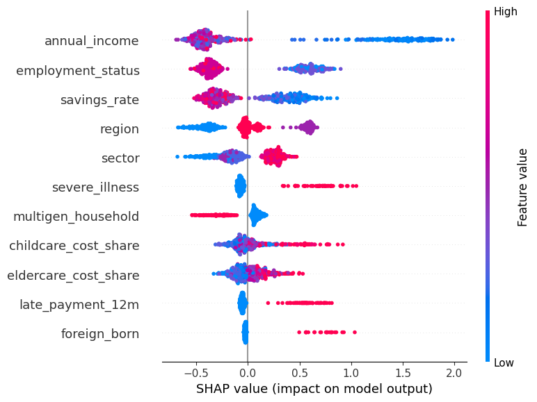

### SHAP Summary Plot (Exp1-3)

*Take `annual_income` as an example. Blue dots (low values) on the right-hand side indicate that low income increases vulnerability, while red dots (high values) on the left show that high income decreases it.*

#### Features mainly pushing vulnerability upward (positive SHAP values):
- **severe_illness**
- **foreign_born**
- **childcare_cost_share / eldercare_cost_share**
- **late_payment_12m**

#### Features mainly pushing vulnerability downward (negative SHAP values):
- **annual_income**
- **savings_rate**
- **employment_status**

#### Mixed effects:
- **multigen_household**: can reduce risk by pooling resources, or increase dependency.  
- **region, sector**: contextual differences affect direction depending on specific values.  

Overall, the model emphasizes that vulnerability is **multi-dimensional**, shaped not only by financial capacity but also by health, migration, family, and social context.
