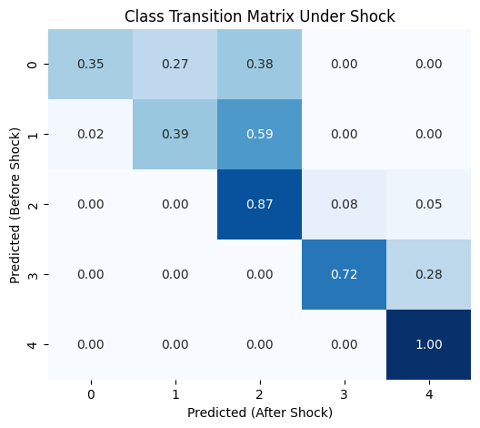

# Exp6-1: External Shock Scenario

## Setup
Shock design was informed by the **Survey on the Impact of the COVID-19 Pandemic on Work and Daily Life** (Japan Institute for Labour Policy and Training, JILPT, Waves 1–7).  
See: [JILPT 2023 report (in Japanese)](https://www.jil.go.jp/institute/research/2023/229.html)

We simulated a COVID-type external shock by applying sector-specific income reductions, higher interest rates (+2pp), and shifts into more precarious employment categories. This design follows empirical evidence on how different groups were disproportionately affected during the pandemic.

---

## Variable Impact under Shock
- **annual_income:** mean −20.8%, median −20.2%  
- **By sector:** worst=0 (−25.0%), best=1 (−5.0%)  
- **employment_status:** 16.2% shifted to more precarious categories  
- **savings_rate:** average change +0.0 pp  
- **late_payment_12m:** average change +0.0 pp  
- **childcare_cost_share:** average change +0.0 pp  
- **eldercare_cost_share:** average change +0.0 pp  
- **By region:** worst hit region=1 (−21.2%)  
- **foreign_born:** 17.9% experienced worsening employment status  
- **multigen_household:** income drop non-multigen=−21.2%, multigen=−20.3%

---

## Metrics
- **Baseline ROC AUC (macro OVR):** 0.911  
- **After Shock ROC AUC (macro OVR):** 0.872  
- **Δ AUC:** −0.039  

The external shock led to a notable decline in predictive accuracy, indicating that the model became less calibrated under stressed conditions.

---

## Transition Matrix
Class transitions before vs. after shock (predicted classes):

- Class 0 → Class 2: **38.2%**  
- Class 1 → Class 2: **59.2%**  
- Class 2 → Class 3/4: **≈13%** (8.1% + 4.5%)  
- Class 3 → Class 4: **27.7%**  
- Class 4: **100% stable**

---

## Key Findings
- The shock mainly pushed **lower-to-middle classes (0–2)** into higher vulnerability tiers.  
- **Class 1 and Class 2** showed the largest upward transitions, consistent with empirical evidence of middle-income households becoming fragile during COVID.  
- Nearly **30% of Class 3** escalated into the most vulnerable group (Class 4).  
- Overall model performance degraded (ΔAUC −0.039), showing that predictive calibration weakens under stress.

---
