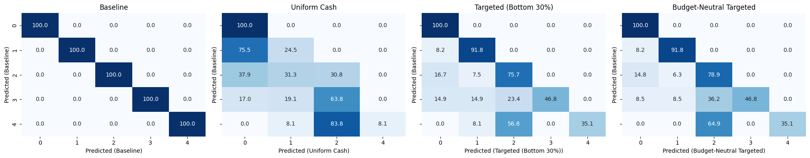

### Exp6-2: Policy Intervention Scenarios

#### Setup
We simulate policy interventions under an external shock.  
Reference: Japan’s **¥100,000 uniform cash transfer (2020 Special Cash Payments)**, plus two targeting variants.

---

#### Policies
1. **Uniform Cash (Universal ¥100,000)** — all households receive ¥100,000.  
2. **Targeted Cash (Bottom 30%)** — only the lowest 30% by income receive ¥100,000.  
3. **Budget-Neutral Targeted (30%)** — same total budget as universal, concentrated on bottom 30% (≈¥333,000 each).  

---

#### Metrics
- **Baseline ROC AUC (macro OVR):** 0.911  

| Policy                         | ROC AUC | Δ AUC   |
|--------------------------------|---------|---------|
| Uniform Cash (Universal)       | 0.714   | −0.197  |
| Targeted (Bottom 30%)          | 0.766   | −0.144  |
| Budget-Neutral Targeted (30%)  | 0.788   | −0.123  |

---

#### Transition Matrices

---

#### Key Findings
- **Uniform Cash (Japan 2020 policy):** maximized equity, but destabilized classes; predictive accuracy collapsed.  
- **Targeted Cash (Bottom 30%):** protected some mid-tier households (Class 2) but left higher classes exposed.  
- **Budget-Neutral Targeted (30%):** most efficient overall.  
  - **36% of Class 3 improved to Class 2**, showing that concentrated aid can stabilize borderline households.  
  - At the same time, **35% of Class 3 still escalated into Class 4**, highlighting severe fragility at the threshold.  
  - **No Class 4 households improved**, confirming that the most vulnerable remain trapped without deeper structural support.  
  - Taken together, this means that while **budget concentration helps those on the edge (Class 3)**, it does not address entrenched vulnerability (Class 4) — one-off transfers act only as a temporary buffer, not a long-term solution.  

---

#### Interpretation
- **Trade-off:** equity vs. efficiency vs. protection.  
- **Universal transfer:** fair but inefficient.  
- **Targeting:** improves efficiency, but fragile Class 3 and entrenched Class 4 remain critical weak points.  
- **Insight:** one-time cash helps the brink households, but **layered, sustained support** is essential for lasting protection.
